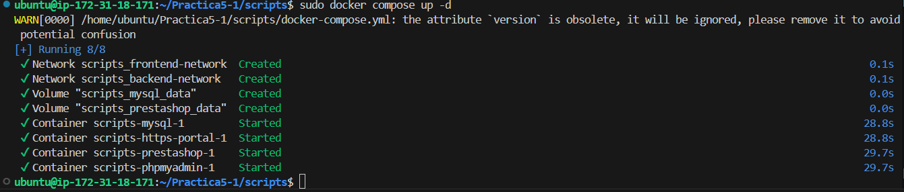

# Practica 5-1
## Estructura del repositorio

- **`scripts/`**:  

  - **`.env`**:  
  Archivo de variables de entorno.

   - **`docker-compose.yml`**:  
  Configura estos 4 servicios principales:
        - 🐬 **MySQL**: Base de datos.
        - 🖥️ **phpMyAdmin**: Interfaz web para gestionar MySQL.
        - 🛒 **Prestashop**: Implementación de la aplicación web.
        - 🔒 **HTTPS-Portal**: Proxy inverso con SSL automático.

