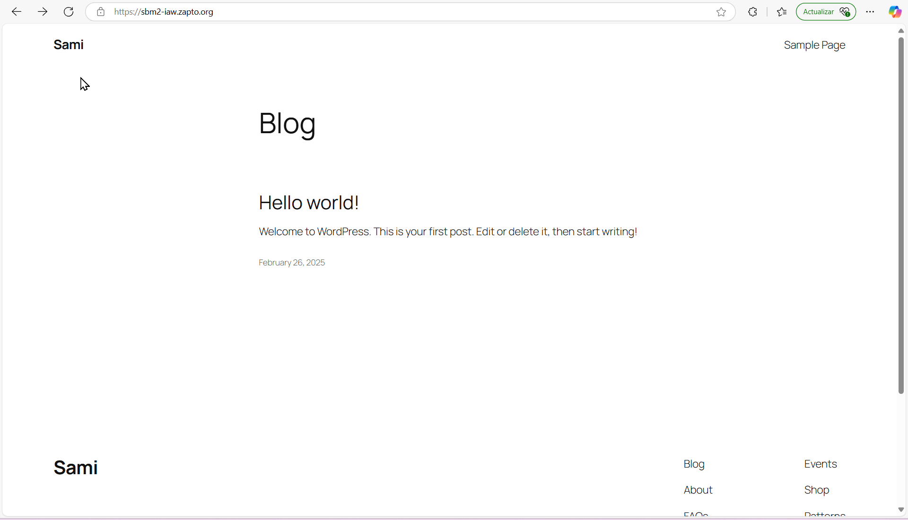

# Practica5-2

## docker-compose.yml

Este archivo de configuración define un entorno para desplegar una aplicación **WordPress** con una base de datos **MySQL**, **phpMyAdmin** para gestionar la base de datos, y un servidor **HTTPS** para conexiones seguras.

🐬 **MySQL**: Base de datos para WordPress. Se configura con variables de entorno y un volumen para almacenar datos.
🖥️ **WordPress**: Aplicación principal. Depende de MySQL y usa un volumen para almacenar archivos.
🗃️ **phpMyAdmin**: Herramienta para gestionar la base de datos MySQL. Depende de MySQL.
✉️ **HTTPS-Portal**: Servidor que maneja conexiones seguras (HTTP/HTTPS) para WordPress.


### https-portal

El servicio **`https-portal`** es un contenedor que actúa como un servidor proxy inverso para manejar conexiones seguras (HTTPS) y redirigirlas a la aplicación WordPress. Su función principal es:

```yaml
https-portal:
  environment:
    DOMAINS: "${DOMAIN} -> http://wordpress:8080"
    STAGE: 'production'
```

- **`DOMAINS`**: Define el dominio y redirige el tráfico a WordPress.
- **`STAGE`**: En modo `production`, habilita HTTPS con certificados válidos.

