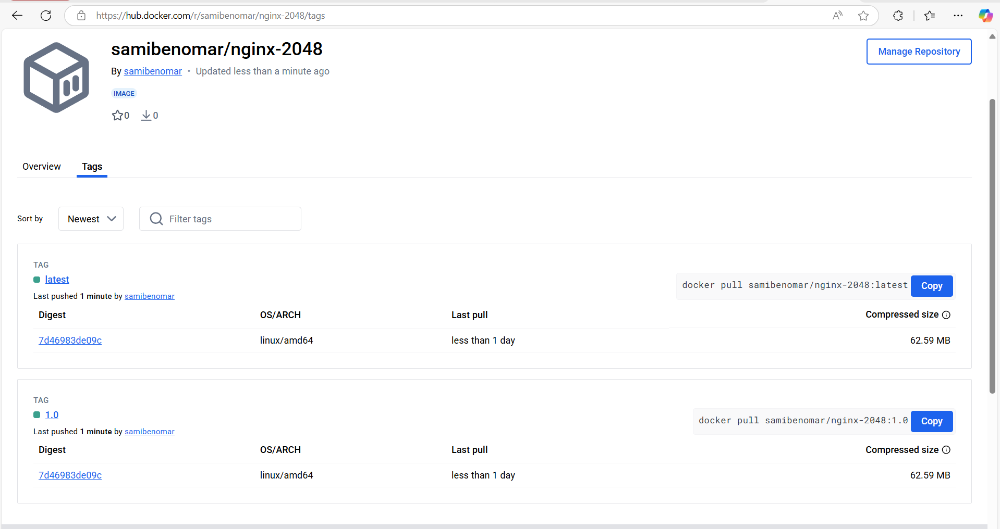
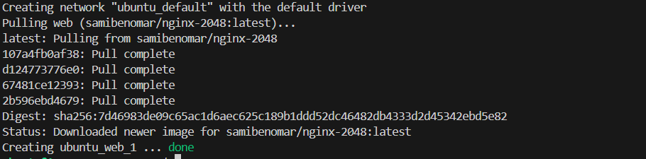

# Practica 5-4


## Docker Nginx 2048

Para la creación de esta imagen he creado el siguiente Dockerfile:
```bash
    FROM ubuntu:latest

    RUN apt-get update && apt-get install -y nginx git && \
        rm -rf /var/lib/apt/lists/*

    RUN rm -rf /var/www/html/*

    RUN git clone https://github.com/josejuansanchez/2048 /var/www/html/

    EXPOSE 80

    CMD ["nginx", "-g", "daemon off;"]

```

### Comandos para construir la imagen

1. 
```bash
    docker build -t <tu-usuario> .
```

2.
```bash
    docker login -u <tu-usuario>
```

3.
```bash
    dock-er tag nginx-2048 tu-usuario/nginx-2048:1.0
    docker tag nginx-2048 tu-usuario/nginx-2048:latest   
```

4.
```bash
    docker push tu-usuario/nginx-2048:latest
    docker push tu-usuario/nginx-2048:1.0
```
   

## Docker Compose
```bash
    services:
        web:
            image: samibenomar/nginx-2048:latest
            ports:
                - "80:80"
```

   
   

## Automatización con GitHub Actions

En los secretos del repositorio creo dos secretos que son el usuario de doker.com y el token de seguridad.
```bash
    name: Docker Publish

    on:
    push:
        branches:
        - main

    jobs:
    push_to_registry:
        name: Push Docker image a Docker Hub
        runs-on: ubuntu-latest

        steps:
        - name: Comprueba repositorios
            uses: actions/checkout@v2

        - name: Login a Docker Hub
            run: echo "${{ secrets.DOCKERHUB_TOKEN }}" | docker login -u "${{ secrets.DOCKERHUB_USERNAME }}" --password-stdin

        - name: Build y push Docker image
            run: |
            docker build -t ${{ secrets.DOCKERHUB_USERNAME }}/nginx-2048:latest ./image
            docker push ${{ secrets.DOCKERHUB_USERNAME }}/nginx-2048:latest
```